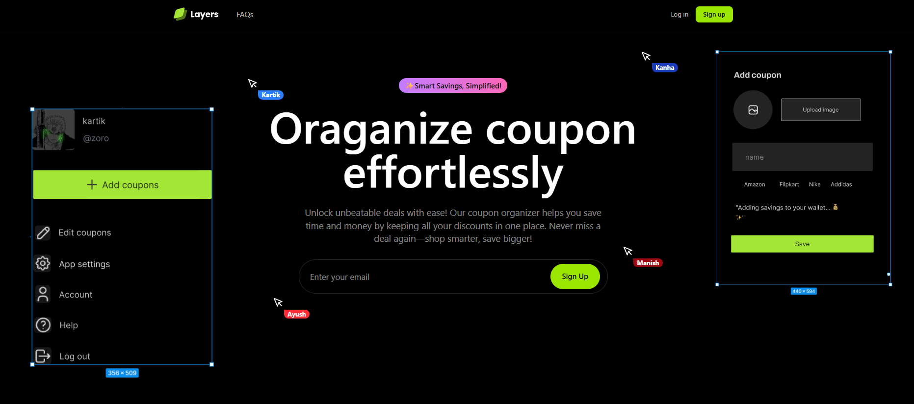

# Layers - Digital Coupon Organizer

A modern web application for organizing, tracking, and managing digital coupons with automated expiry notifications and sharing capabilities.




## 🚀 Features

### Core Functionality
- **User Authentication**: Secure registration and login system with password hashing
- **Coupon Management**: Add, edit, delete, and organize digital coupons
- **Smart Dashboard**: Intuitive grid-based interface with real-time filtering
- **Advanced Search**: Filter by category, store, expiry date, and discount percentage
- **Expiry Alerts**: Automated email notifications for soon-to-expire coupons
- **Coupon Sharing**: Share coupons with other registered users
- **Usage Tracking**: Mark coupons as used and track savings

### User Experience
- **Responsive Design**: Optimized for mobile, tablet, and desktop
- **Modern UI**: Dark theme with lime accents and smooth animations
- **AJAX Search**: Real-time filtering without page reloads
- **Interactive Elements**: Copy-to-clipboard, hover effects, and modal interfaces
- **Profile Management**: Custom profile pictures and user statistics

## 🛠️ Technology Stack

### Backend
- **PHP 8.1+**: Server-side logic and templating
- **MySQL 8.0**: Relational database with ACID compliance
- **PDO**: Secure database abstraction layer with prepared statements
- **PHPMailer**: Email delivery for notifications
- **Composer**: Dependency management

### Frontend
- **HTML5**: Semantic markup and modern standards
- **Tailwind CSS**: Utility-first CSS framework for rapid development
- **JavaScript (ES6+)**: Interactive functionality and DOM manipulation
- **GSAP**: High-performance animations and scroll triggers
- **AJAX**: Asynchronous data loading and form submissions

### Development Tools
- **XAMPP/WAMP**: Local development environment
- **Git**: Version control
- **VS Code**: Development environment

## 📋 Prerequisites

Before installing Layers, ensure you have:

- **Web Server**: Apache 2.4+ or Nginx
- **PHP**: Version 8.1 or higher
- **MySQL**: Version 8.0 or higher
- **Composer**: For PHP dependency management
- **Node.js** (optional): For Tailwind CSS compilation

## 🔧 Installation

### 1. Clone the Repository
```bash
git clone https://github.com/yourusername/layers.git
cd layers
```

### 2. Install Dependencies
```bash
# Install PHP dependencies
composer install

# Install frontend dependencies (if using Tailwind CLI)
npm install
```

### 3. Database Configuration
1. Open `src/config/db.php`
2. Update database credentials:
```php
define('DB_SERVER', 'localhost');
define('DB_USERNAME', 'your_username');
define('DB_PASSWORD', 'your_password');
define('DB_NAME', 'coupon_organizer');
```

### 4. Database Setup
The application will automatically:
- Create the database if it doesn't exist
- Set up all required tables
- Handle schema migrations

### 5. Email Configuration
1. Open `src/includes/expiry_alert.php`
2. Configure SMTP settings:
```php
$mail_config = [
    'host' => 'smtp.gmail.com',
    'username' => 'your-email@gmail.com',
    'password' => 'your-app-password',
    'port' => 587
];
```

### 6. Web Server Setup
Point your web server document root to the `src/` directory.

For XAMPP users:
- Place the project in `htdocs/layers/`
- Access via `http://localhost/layers/src/`

## 📂 Project Structure

```
layers/
├── src/                          # Main application directory
│   ├── assets/                   # Static assets
│   │   ├── images/              # Images and icons
│   │   └── js/                  # JavaScript files
│   ├── components/              # Reusable PHP components
│   │   ├── header.php
│   │   └── footer.php
│   ├── config/                  # Configuration files
│   │   ├── db.php              # Database connection
│   │   ├── db_setup.php        # Database schema
│   │   └── db_setup_notifications.php
│   ├── cron/                   # Automated tasks
│   │   ├── check_expiring_coupons.php
│   │   └── setup_cron.php
│   ├── includes/               # Include files
│   │   ├── auth_header.php     # Authentication logic
│   │   ├── expiry_alert.php    # Email notifications
│   │   └── header.php          # Common header
│   ├── logs/                   # Application logs
│   ├── pages/                  # Application pages
│   │   ├── dashboard.php       # Main dashboard
│   │   ├── login.php          # User authentication
│   │   ├── register.php       # User registration
│   │   ├── profile.php        # User profile
│   │   └── [other pages]
│   ├── uploads/               # User uploads
│   │   └── profile_images/
│   ├── index.php             # Landing page
│   ├── output.css            # Compiled Tailwind CSS
│   └── script.js             # Main JavaScript file
├── vendor/                   # Composer dependencies
├── composer.json            # PHP dependencies
├── package.json            # Node.js dependencies
└── README.md              # This file
```

## 🎯 Usage

### Getting Started
1. **Register an Account**: Create a new user account with your email
2. **Login**: Access your personal dashboard
3. **Add Coupons**: Click "Add Coupon" to start organizing your deals
4. **Set Up Notifications**: Configure email alerts for expiring coupons

### Managing Coupons
- **Add**: Use the modal form to input coupon details
- **Edit**: Click the edit icon on any coupon card
- **Delete**: Remove unwanted coupons with confirmation
- **Mark as Used**: Track which coupons you've redeemed
- **Share**: Send coupons to other registered users

### Dashboard Features
- **Search**: Type to find coupons by name, store, or code
- **Filter**: Use category dropdown to narrow results
- **Sort**: Organize by expiry date or discount percentage
- **Toggle Expired**: Show or hide expired coupons

## 🔔 Automated Notifications

### Expiry Alert System
The application includes an automated notification system:

1. **Daily Checks**: Runs via cron job to identify expiring coupons
2. **Email Alerts**: Sends personalized notifications 24 hours before expiry
3. **Visual Indicators**: Dashboard highlights soon-to-expire coupons
4. **Testing Mode**: Use `?test=1` parameter for manual testing

### Setting Up Cron Jobs
Add this to your crontab for daily checks:
```bash
# Run daily at 9:00 AM
0 9 * * * /usr/bin/php /path/to/layers/src/cron/check_expiring_coupons.php
```

## 🎨 Customization

### Styling
- Modify `src/input.css` for custom Tailwind styles
- Recompile with `npm run build` or `npx tailwindcss build`
- Color scheme can be adjusted in `tailwind.config.js`

### Email Templates
- Customize email layouts in `src/includes/expiry_alert.php`
- Modify HTML structure and styling as needed

### Categories
- Add new coupon categories in the database `categories` table
- Update frontend dropdown options accordingly

## 🔒 Security Features

- **Password Hashing**: Uses PHP's `password_hash()` with salt
- **SQL Injection Prevention**: PDO prepared statements throughout
- **XSS Protection**: All outputs escaped with `htmlspecialchars()`
- **Session Security**: Secure session management with regeneration
- **Input Validation**: Server-side validation for all forms
- **File Upload Security**: Type and size validation for profile images

## 📊 Database Schema

### Core Tables
- **users**: User accounts and profile information
- **coupons**: Coupon details and metadata
- **shared_coupons**: Coupon sharing relationships
- **categories**: Predefined coupon categories
- **notifications**: User notification history

### Relationships
- One-to-many: Users → Coupons
- Many-to-many: Users ↔ Shared Coupons
- Foreign key constraints ensure data integrity

## 🐛 Troubleshooting

### Common Issues

**Database Connection Error**
```
Solution: Check database credentials in src/config/db.php
Ensure MySQL service is running
```

**Email Notifications Not Working**
```
Solution: Verify SMTP settings in src/includes/expiry_alert.php
Check if app passwords are required for Gmail
```

**Tailwind Styles Not Loading**
```
Solution: Ensure output.css is compiled
Run: npx tailwindcss -i src/input.css -o src/output.css --watch
```

**XAMPP Permission Issues**
```
Solution: Ensure proper file permissions
On Linux/Mac: chmod -R 755 layers/
```

## 🤝 Contributing

1. Fork the repository
2. Create a feature branch (`git checkout -b feature/AmazingFeature`)
3. Commit your changes (`git commit -m 'Add some AmazingFeature'`)
4. Push to the branch (`git push origin feature/AmazingFeature`)
5. Open a Pull Request

### Development Guidelines
- Follow PSR-12 PHP coding standards
- Use meaningful commit messages
- Add comments for complex logic
- Test thoroughly before submitting

## 📝 License

This project is licensed under the MIT License - see the [LICENSE](LICENSE) file for details.

## 🙋‍♂️ Support

If you encounter any issues or have questions:

1. Check the [Issues](https://github.com/yourusername/layers/issues) page
2. Create a new issue with detailed description
3. Include error messages and steps to reproduce

## 🔮 Future Enhancements

- [ ] Mobile app development (React Native/Flutter)
- [ ] Browser extension for automatic coupon detection
- [ ] Integration with popular shopping sites
- [ ] Advanced analytics and savings reports
- [ ] Social features and coupon communities
- [ ] API for third-party integrations
- [ ] Multi-language support
- [ ] Dark/light theme toggle


## 🎉 Acknowledgments

- [Tailwind CSS](https://tailwindcss.com/) for the utility-first CSS framework
- [GSAP](https://greensock.com/gsap/) for high-performance animations
- [PHPMailer](https://github.com/PHPMailer/PHPMailer) for email functionality
- [Font Awesome](https://fontawesome.com/) for icons (if used)

---

**Built with ❤️ for smart shoppers who never want to miss a deal!**

For more information, visit our [documentation](docs/) or contact the development team.
